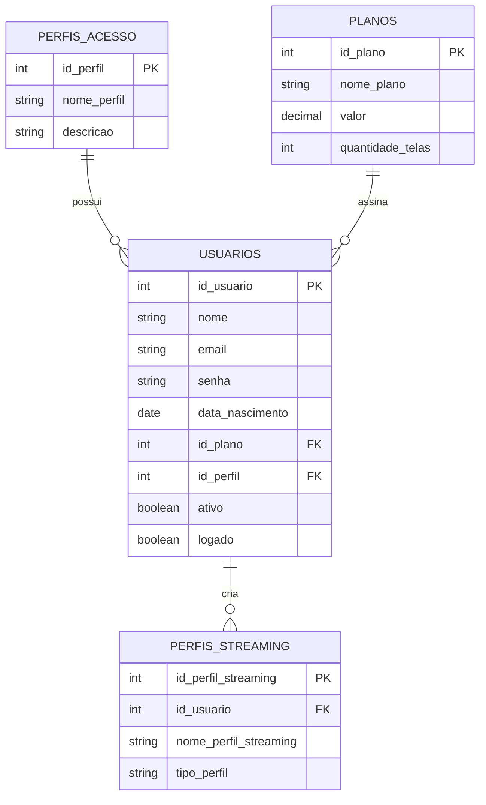

# Sistema de Streaming - Banco de Dados SQL

## Sobre o Projeto

Este projeto consiste na modelagem e implementação de um banco de dados relacional para uma plataforma de streaming utilizando **SQL** e **SGBD SQLite**. 

O objetivo principal foi aplicar na prática conceitos essenciais de engenharia de dados, focando em integridade referencial, constraints avançadas e automação de regras de negócio diretamente na camada de persistência.



---

## Funcionalidades e Destaques Técnicos

* **Ativação de Chaves Estrangeiras:** Uso do comando explícito `PRAGMA` para habilitar restrições no ambiente SQLite.
* **Modelagem Relacional Sólida:** Mapeamento completo de cardinalidades (1:N) estruturado de forma escalável.
* **Garantia de Consistência (`Constraints`):** Utilização de cláusulas `CHECK` e `UNIQUE` para mitigar a inserção de dados inconsistentes (como valores negativos ou e-mails duplicados).
* **Integridade Referencial Automatizada:** Configuração de `ON DELETE CASCADE` na tabela de perfis de streaming para evitar registros órfãos ao remover contas de usuários.
* **Automação via Camada de Dados (`Triggers`):** Implementação de gatilhos automáticos otimizados com a cláusula `WHEN` para validação restritiva antes do commit de novos registros.

---

## Regras de Negócio e Amostras de Código

### 1. Validação de Limite de Perfis (Trigger)
Cada usuário cadastrado na plataforma pode possuir, no máximo, **4 perfis de streaming**. Caso tente inserir o 5º perfil para o mesmo usuário, a operação é abortada lançando uma exceção personalizada através da função `RAISE`.

```sql
CREATE TRIGGER trg_limite_perfis
BEFORE INSERT ON perfis_streaming
FOR EACH ROW
WHEN (
    SELECT COUNT(*)
    FROM perfis_streaming
    WHERE id_usuario = NEW.id_usuario
) >= 4
BEGIN
    SELECT RAISE(ABORT, 'Limite de 4 perfis atingido');
END;
```

### 2. Estrutura do Banco e Restrições de Integridade
Abaixo estão os trechos de definição das tabelas estruturadas com validações de negócios em nível de banco de dados:

```sql
PRAGMA foreign_keys = ON;

CREATE TABLE planos (
    id_plano INTEGER PRIMARY KEY,
    nome_plano TEXT NOT NULL UNIQUE,
    valor REAL NOT NULL CHECK(valor >= 0),
    quantidade_telas INTEGER NOT NULL CHECK(quantidade_telas > 0)
);

CREATE TABLE perfis_streaming (
    id_perfil_streaming INTEGER PRIMARY KEY AUTOINCREMENT,
    id_usuario INTEGER NOT NULL,
    nome_perfil_streaming TEXT NOT NULL,
    tipo_perfil TEXT DEFAULT 'Adulto' CHECK(tipo_perfil IN ('Adulto','Infantil')),

    UNIQUE(id_usuario, nome_perfil_streaming),

    FOREIGN KEY (id_usuario) REFERENCES usuarios(id_usuario) ON DELETE CASCADE
);
```

---

## Tecnologias e Ferramentas

* **Linguagem:** SQL (Structured Query Language)
* **SGBD:** SQLite
* **Interface de Desenvolvimento:** SQLiteOnline
* **Documentação:** Mermaid.js / Markdown

---

## Testes de Validação Executados

Para garantir o perfeito funcionamento do ecossistema, os seguintes cenários de testes foram validados com sucesso no script:
1. **Cenário de Fluxo Padrão:** Inserção estruturada de perfis de acesso, planos padrão do sistema e usuários administrativos.
2. **Cenário de Limpeza Automatizada:** Exclusão de uma conta-mãe de usuário e validação do sumiço em cascata de seus respectivos perfis.
3. **Cenário de Estresse da Trigger:** Tentativa de inserção do 5º perfil para um mesmo usuário (`id_usuario = 2`), resultando no bloqueio da query e retorno da mensagem de erro esperada.

---

## Objetivo Profissional

Projeto desenvolvido de forma independente para consolidar conhecimentos fundamentais em arquitetura de bancos de dados relacionais e tratamento de regras de negócio em cenários semelhantes ao de plataformas reais do mercado de streaming (como Netflix, Disney+ e Prime Video).
