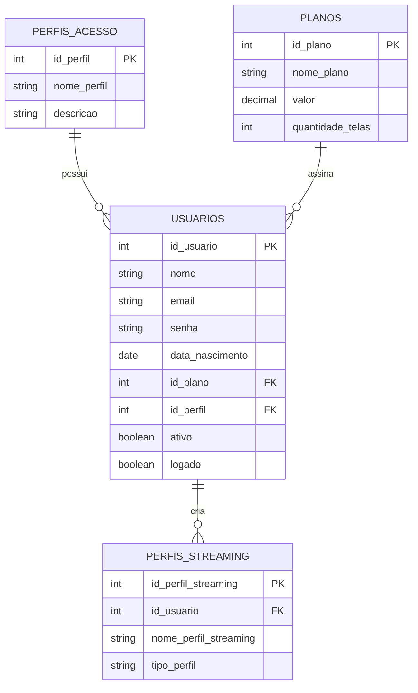

# Sistema de Streaming - Banco de Dados SQL

## Sobre o Projeto

Este projeto consiste na modelagem e implementação de um banco de dados para uma plataforma de streaming utilizando SQL e SQLite.

O objetivo foi praticar conceitos fundamentais de Banco de Dados, como modelagem relacional, integridade de dados e implementação de regras de negócio através de constraints e triggers.

Regra de Negócio:
• Máximo de 4 perfis de streaming por usuário.
• Implementada através de Trigger SQL.

## Funcionalidades

* Cadastro de usuários
* Cadastro de planos de assinatura
* Controle de perfis de acesso
* Criação de perfis de streaming por usuário
* Relacionamentos entre tabelas utilizando chaves estrangeiras
* Exclusão em cascata
* Restrições de integridade (CHECK e UNIQUE)
* Trigger para limitar a quantidade máxima de perfis por conta

## Estrutura do Banco

### Tabelas

* perfis_acesso
* planos
* usuarios
* perfis_streaming

### Relacionamentos

* Um usuário possui um perfil de acesso.
* Um usuário pode possuir um plano de assinatura.
* Um usuário pode possuir vários perfis de streaming.
* Ao excluir um usuário, seus perfis são removidos automaticamente.

## Tecnologias Utilizadas

* SQL
* SQLite
* SQLiteOnline

## Regra de Negócio Implementada

Cada usuário pode possuir no máximo 4 perfis de streaming.

Essa validação é realizada através de uma trigger executada antes da inserção de novos perfis.

## Testes Realizados

* Criação das tabelas
* Inserção de usuários
* Inserção de planos
* Criação de perfis de streaming
* Validação das chaves estrangeiras
* Teste de exclusão em cascata
* Teste do limite máximo de perfis por conta

## Objetivo

Projeto desenvolvido para praticar modelagem de banco de dados, SQL e implementação de regras de negócio em um cenário semelhante ao de plataformas reais de streaming.
